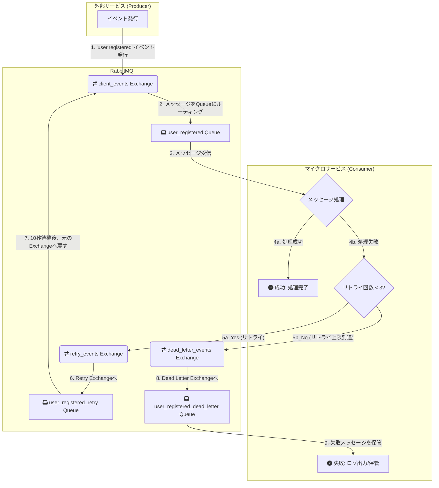

# RabbitMQ Messaging Flow

This document outlines the message flow for RabbitMQ events, including the retry and dead-letter logic.

```mermaid
graph TD
    subgraph "外部サービス (Producer)"
        A[イベント発行]
    end

    subgraph "RabbitMQ"
        B(fa:fa-exchange client_events Exchange)
        C[fa:fa-inbox user_registered Queue]
        D(fa:fa-exchange retry_events Exchange)
        E[fa:fa-inbox user_registered_retry Queue]
        F(fa:fa-exchange dead_letter_events Exchange)
        G[fa:fa-inbox user_registered_dead_letter Queue]
    end

    subgraph "マイクロサービス (Consumer)"
        H{メッセージ処理}
        I[fa:fa-check-circle 成功: 処理完了]
        J{リトライ回数 < 3?}
        K[fa:fa-times-circle 失敗: ログ出力/保管]
    end

    %% 正常系フロー (Happy Path)
    A -- "1. 'user.registered' イベント発行" --> B
    B -- "2. メッセージをQueueにルーティング" --> C
    C -- "3. メッセージ受信" --> H
    H -- "4a. 処理成功" --> I

    %% 失敗・リトライフロー (Retry Path)
    H -- "4b. 処理失敗" --> J
    J -- "5a. Yes (リトライ)" --> D
    D -- "6. Retry Exchangeへ" --> E
    E -- "7. 10秒待機後、元のExchangeへ戻す" --> B

    %% デッドレターフロー (Dead Letter Path)
    J -- "5b. No (リトライ上限到達)" --> F
    F -- "8. Dead Letter Exchangeへ" --> G
    G -- "9. 失敗メッセージを保管" --> K
```
